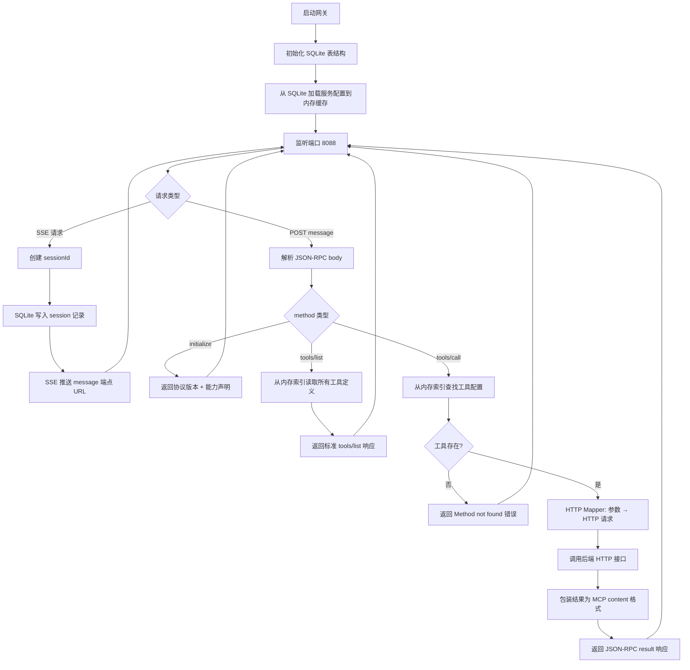
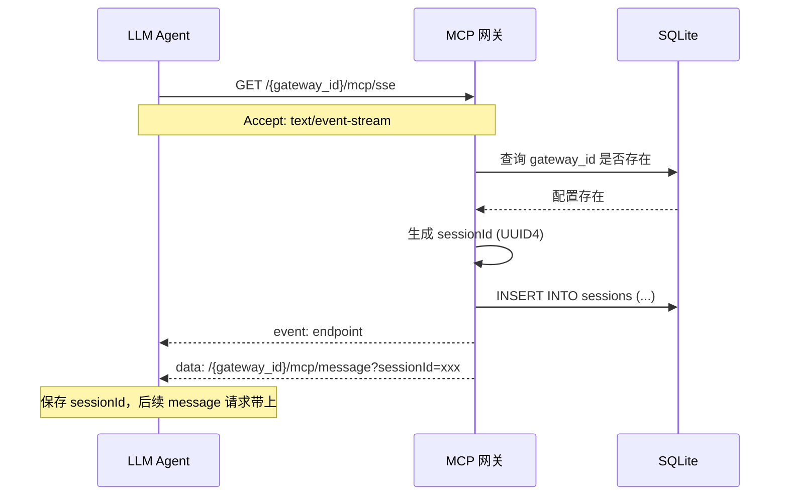
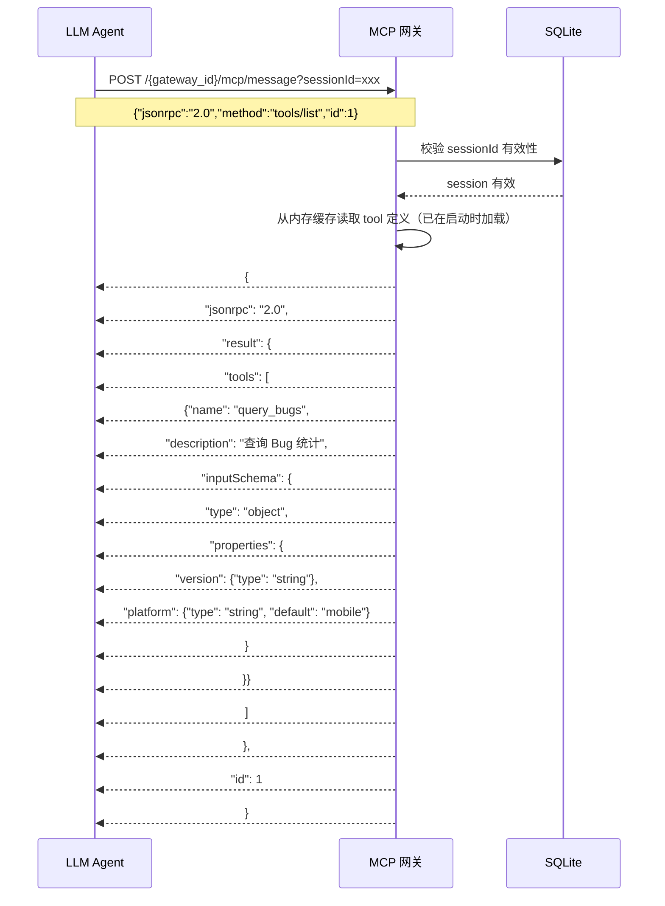
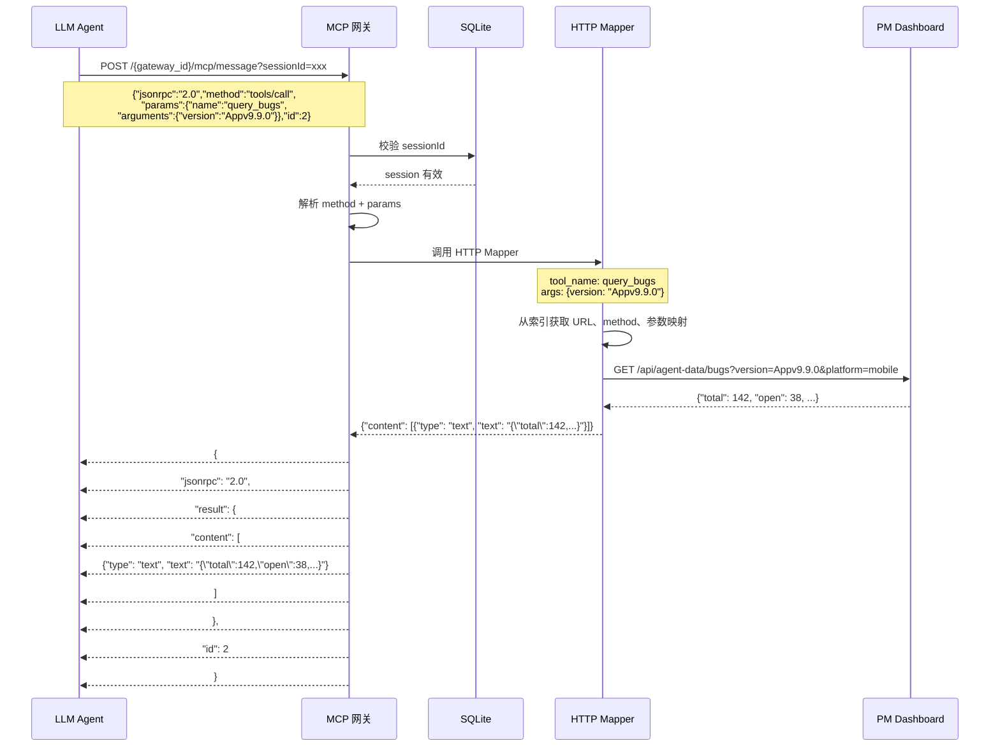

# MCP 网关设计文档

> 将后端 HTTP API 自动转换为 MCP 协议工具，供 Knot 等 LLM Agent 调用。

---

## 一、系统架构图

```
┌─────────────────────────────────────────────────────┐
│                     LLM Agent (Knot)                 │
└────────────┬──────────────────────────┬─────────────┘
             │ SSE (长连接)              │ POST (message)
             ▼                           ▼
┌─────────────────────────────────────────────────────┐
│                   FastAPI 路由层                      │
│                                                     │
│  GET  /{gateway_id}/mcp/sse     → SSE 连接入口       │
│  POST /{gateway_id}/mcp/message  → JSON-RPC 消息入口  │
└────────────┬──────────────────┬──────────────────────┘
             │                  │
             ▼                  ▼
┌────────────────────┐  ┌─────────────────────────────┐
│   MCP 协议层        │  │    MCP 会话管理              │
│                    │  │                             │
│  · JSON-RPC 编解码  │  │  · 创建/销毁 seesion        │
│  · 方法路由分发     │  │  · 超时回收                  │
│  · 错误响应构造     │  │  · sessionId ↔ 网关映射关联  │
└────────┬───────────┘  └─────────────────────────────┘
         │
         ▼
┌────────────────────┐     ┌──────────────────────────┐
│   服务注册中心       │     │   HTTP Mapper             │
│                    │────▶│                           │
│  · SQLite 存储配置  │     │  · 参数映射 (MCP→HTTP)     │
│  · 构建 tools/list  │     │  · 发送 HTTP 请求          │
│  · 工具索引(内存缓存)│     │  · 结果包装 (HTTP→MCP)     │
└────────────────────┘     └───────────┬───────────────┘
                                       │
                                       ▼
                              ┌────────────────────┐
                              │   后端 HTTP 服务     │
                              │   (PM Dashboard)    │
                              └────────────────────┘
```

---

## 二、核心流程图



---

## 三、时序图

### 3.1 SSE 连接建立



### 3.2 tools/list（工具发现）



### 3.3 tools/call（工具调用）



---

## 四、模块详细设计

### 4.1 protocol.py — JSON-RPC 2.0 编解码

```
输入: JSON-RPC 请求字符串
输出: 解析后的 Python 对象

请求格式:
{
  "jsonrpc": "2.0",
  "method": "tools/call",
  "params": {
    "name": "query_bugs",
    "arguments": {"version": "Appv9.9.0"}
  },
  "id": 1
}

响应格式:
{
  "jsonrpc": "2.0",
  "result": { ... },
  "id": 1
}

错误响应:
{
  "jsonrpc": "2.0",
  "error": {
    "code": -32601,
    "message": "Method not found"
  },
  "id": 1
}
```

| 函数 | 职责 |
|------|------|
| `parse_request(raw: str) -> JsonRpcRequest` | 字符串 → 请求对象，校验 jsonrpc 字段 |
| `build_response(result, request_id) -> str` | 构造成功响应 JSON 字符串 |
| `build_error(code, message, request_id) -> str` | 构造错误响应 JSON 字符串 |
| `JsonRpcRequest` (dataclass) | jsonrpc, method, params, id |

### 4.2 session.py — SSE 会话管理

| 函数 | 职责 |
|------|------|
| `create_session(gateway_id: str) -> str` | 生成 UUID4 sessionId，写入 SQLite sessions 表 |
| `validate_session(session_id: str) -> bool` | 从 SQLite 校验 session 是否存在、未过期，同时更新 last_active |
| `send_endpoint_event(session_id: str)` | 推送 SSE event，包含 message 端点 URL |
| `cleanup_expired_sessions()` | 定时任务：DELETE 超时 session（默认 30min） |

### 4.3 handler.py — 方法路由分发

```python
# 路由表
HANDLERS = {
    "initialize":     handle_initialize,
    "tools/list":     handle_tools_list,
    "tools/call":     handle_tools_call,
    "resources/list": handle_resources_list,   # 预留扩展点，MVP 返回空列表
    "ping":           handle_ping,
}
```

| 处理器 | MVP | 说明 |
|--------|:--:|------|
| `handle_initialize` | ✅ | 返回协议版本 + 能力声明 |
| `handle_tools_list` | ✅ | 返回所有工具定义及入参 schema |
| `handle_tools_call` | ✅ | 根据 name+arguments 调后端接口 |
| `handle_resources/list` | 🔜 | 返回 `{"resources": []}`，后续用于暴露可检索数据（文件、表结构等） |
| `handle_ping` | ✅ | 心跳 |

### 4.4 http.py — HTTP Mapper

```python
async def map_and_call(
    tool_config: dict,       # 从索引查出的工具配置
    arguments: dict,         # LLM 传入的参数
) -> dict:                   # MCP content 格式
```

流程：
1. 从 `tool_config["mapper"]` 取 http method / url / params 定义
2. 将 `arguments` 按 params 定义映射为 query string 或 request body
3. `httpx.AsyncClient` 发请求
4. 后端响应包装为 `{content: [{type: "text", text: json.dumps(response)}]}`

### 4.5 loader.py — 服务注册加载器

```python
def load_services(db_path: str) -> dict:
    """
    从 SQLite 加载所有 gateway 和 tool 配置，返回内存缓存结构:

    {
      "gateways": {
        "gd10090": {
          "name": "...",
          "tools": [...]
        }
      },
      "tool_index": {  # name → tool_config 快速查找
        "query_bugs": {
          "name": "query_bugs",
          "description": "...",
          "inputSchema": {...},
          "mapper": {"type": "http", "method": "GET", "url": "...", "params": [...]}
        },
        ...
      }
    }
    """
```

注意：**服务配置读多写少，启动时从 SQLite 全量加载到内存，运行时不再查库。**
Session 不同，每次请求都要读写，所以直接操作 SQLite。

---

## 五、SQLite 表结构设计

### 5.1 表结构

```sql
-- 网关定义
CREATE TABLE IF NOT EXISTS gateways (
    id          TEXT PRIMARY KEY,    -- 如 "gd10090"
    name        TEXT NOT NULL,       -- 如 "PM Dashboard Agent 工具集"
    description TEXT DEFAULT '',
    created_at  TEXT NOT NULL DEFAULT (datetime('now')),
    updated_at  TEXT NOT NULL DEFAULT (datetime('now'))
);

-- HTTP 工具定义
CREATE TABLE IF NOT EXISTS tools (
    name        TEXT NOT NULL,       -- 如 "query_bugs"
    gateway_id  TEXT NOT NULL REFERENCES gateways(id),
    description TEXT NOT NULL,       -- 给 LLM 看的描述
    http_method TEXT NOT NULL,       -- GET / POST
    http_url    TEXT NOT NULL,       -- 后端服务地址
    param_schema TEXT NOT NULL,      -- JSON: 入参 schema（inputSchema）
    sort_order  INTEGER DEFAULT 0,
    PRIMARY KEY (gateway_id, name)
);

-- SSE 会话（频繁创建/销毁）
CREATE TABLE IF NOT EXISTS sessions (
    session_id  TEXT PRIMARY KEY,     -- UUID4
    gateway_id  TEXT NOT NULL,
    created_at  REAL NOT NULL,        -- time.time() 时间戳
    last_active REAL NOT NULL         -- 最近活跃时间
);

CREATE INDEX IF NOT EXISTS idx_sessions_gateway ON sessions(gateway_id);
CREATE INDEX IF NOT EXISTS idx_sessions_last_active ON sessions(last_active);
```

### 5.2 数据初始化

YAML 作为 seed data，仅用于首次导入 SQLite：

```yaml
# config/seed.yaml —— 初始化 SQLite 用，运行时不再读取
gateways:
  gd10090:
    name: "PM Dashboard Agent 工具集"
    description: "App 研发生命周期数据查询"
    tools:
      - name: get_status
        description: |
          【每次对话必调】获取当前版本全局状态概览。
          返回：版本号、Bug/需求/测试概况、阶段时间线。
        http_method: GET
        http_url: "http://pm-dashboard:8765/api/agent-data/status"
        param_schema:
          type: object
          properties:
            version:
              type: string
              description: 版本号，如 Appv9.9.0
            platform:
              type: string
              default: mobile
              description: 平台，mobile 或 desktop
          required: [version]

      - name: query_bugs
        description: |
          查询当前版本 Bug 统计：总数、严重程度分布、模块分布。
          不返回单个 Bug 明细。需要趋势调用 trend_bugs。
        http_method: GET
        http_url: "http://pm-dashboard:8765/api/agent-data/bugs"
        param_schema:
          type: object
          properties:
            version:
              type: string
            platform:
              type: string
              default: mobile
          required: [version]
```

初始化命令：

```bash
python -m src.cli seed --yaml config/seed.yaml --db data/gateway.db
```

### 5.3 为什么分两种策略

| 数据 | 特性 | 存储策略 |
|------|------|---------|
| gateway / tools | 读多写少，量小，启动后不变 | SQLite → 启动时全量加载到内存 dict |
| sessions | 频繁创建/销毁/更新，需持久化 | 每次请求直接读写 SQLite |

工具配置的 YAML 只作为 seed，运行时完全走 SQLite（取出来就是 dict 缓存），这样既持久化又高效。

---

## 六、部署架构

```
┌──────────────────────────────────────────────┐
│                 IDC 内网                      │
│                                              │
│  ┌──────────────────┐   ┌─────────────────┐  │
│  │  PM Dashboard     │   │  MCP Gateway     │  │
│  │  :8765            │◀──│  :8088           │  │
│  │                   │   │                  │  │
│  │  /api/agent-data/ │   │  data/            │  │
│  │    bugs           │   │    gateway.db ─┐  │  │
│  │    stories         │   │               │  │  │
│  │    tests           │   │  ┌─ gateways  │  │  │
│  │    ...             │   │  ├─ tools     │  │  │
│  └──────────────────┘   │  └─ sessions   │  │  │
│                          └───────┬────────┘  │
│                                  │            │
└──────────────────────────────────┼────────────┘
                                   │
                           Knot 云端 Agent
```

- 两个服务同 Docker 网络，MCP Gateway 通过 `pm-dashboard` 访问
- `gateway.db` 存所有配置和 session，volume 挂载到宿主机
- Knot 通过 iGate 策略访问 IDC 内网 `http://<mcp-gateway>:8088`

---

## 七、实施计划

**主线原则：每个阶段结束时都有一个可运行、可验证的交付物。**

### 阶段 1：项目骨架

**交付物**：`pip install -e ".[dev]"` 成功，`python -m src` 不报 import 错误。

```
mcp-gateway/
├── pyproject.toml          ← 依赖声明
├── src/
│   ├── __init__.py         ← 空。标志着 src 是 Python 包
│   ├── mcp/
│   │   └── __init__.py
│   ├── mapper/
│   │   └── __init__.py
│   └── registry/
│       └── __init__.py
├── config/
│   └── seed.yaml           ← PM Dashboard 工具集定义
├── data/                   ← .gitkeep，运行时放 gateway.db
└── tests/
    └── __init__.py
```

写完 `pyproject.toml` 后执行 `pip install -e ".[dev]"`，确认 `import src` 不报错。这就通了，后面加代码不会卡在环境上。

### 阶段 2：数据层

**交付物**：`python -m src.cli seed` 执行后 SQLite 里有数据，`sqlite3 data/gateway.db "SELECT * FROM tools"` 能查到。

- `src/db.py`：建表函数 + 获取连接，返回 `sqlite3.Row` 方便字典访问
- `src/cli.py`：`cli seed` 子命令，读 `config/seed.yaml` → 写 `gateways` + `tools` 表

### 阶段 3：协议层

**交付物**：`pytest tests/test_protocol.py -v` 全绿。

- `src/mcp/protocol.py`：
  - `JsonRpcRequest` dataclass（`jsonrpc`, `method`, `params`, `id`）
  - `parse(raw: str) -> JsonRpcRequest`
  - `build_response(result: dict, request_id: int | str) -> str`
  - `build_error(code: int, message: str, request_id: int | str | None) -> str`
- `tests/test_protocol.py`：覆盖正常解析、缺字段、错误码构造

**这是唯一能纯单测就覆盖的模块，放最前面。**

### 阶段 4：核心服务

**交付物**：`pytest tests/test_session.py tests/test_loader.py -v` 全绿。

1. `src/mcp/session.py`（依赖阶段 2 的表结构）：
   - `create_session(gateway_id) -> str`
   - `validate_session(session_id) -> bool`（同时更新 last_active）
   - `cleanup_expired_sessions(timeout=1800)`
2. `src/registry/loader.py`（依赖阶段 2 的表结构）：
   - `load_services() -> dict`——全量加载 gateway + tool 配置到内存

### 阶段 5：业务逻辑

**交付物**：handler 和 mapper 各自可单测。

1. `src/mapper/http.py`（依赖阶段 4 的 loader）：
   - `async def call(tool_config, arguments) -> dict`——参数映射 + httpx 请求 + 结果包装
2. `src/mcp/handler.py`（依赖阶段 3 的 protocol + 阶段 4 的 loader + 阶段 5 的 mapper）：
   - `async def dispatch(request: JsonRpcRequest) -> str`——查路由表，调对应 handler

### 阶段 6：API 层

**交付物**：`uvicorn app:app --port 8088` 启动后用 curl 调 `/health` 返回 200。

- `app.py`：组装 FastAPI + 注册路由
  - `GET /{gateway_id}/mcp/sse`（依赖 session + loader）
  - `POST /{gateway_id}/mcp/message`（依赖 handler）
  - `GET /health`

### 阶段 7：端到端验证

**交付物**：用 curl 模拟完整 MCP 生命周期——SSE 建连 → initialize → tools/list → tools/call。

不用 Knot，只用 curl 验证协议流程正确。这是接入 Knot 前的最后一道关卡。

### 阶段 8：部署上线

- Dockerfile + docker-compose
- 部署到 IDC 服务器
- 在 Knot 平台创建智能体，配置 MCP 端点
- 在 Knot 网页对话中验证

---

## 主线一览

```
阶段1 骨架 → 阶段2 数据层 → 阶段3 协议层 → 阶段4 核心服务
                                            ↓
          阶段8 部署 ← 阶段7 端到端 ← 阶段6 API ← 阶段5 业务逻辑
```

**规则**：每个阶段只依赖前面已完成阶段的产物，不向前跳跃。卡在某个阶段就说明依赖没搞好，回去修。
